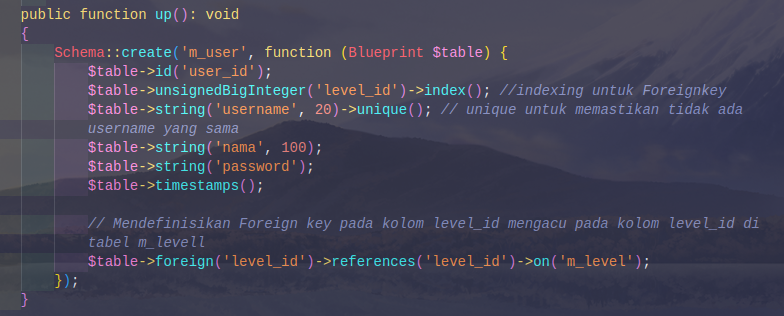
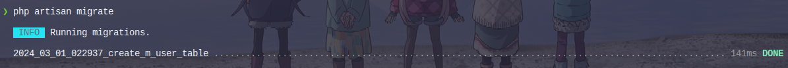
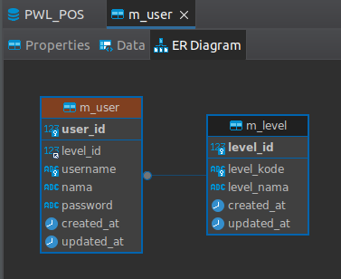
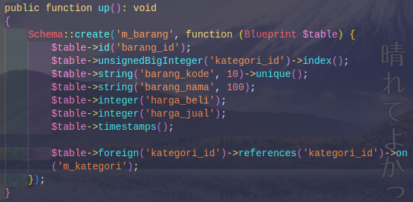
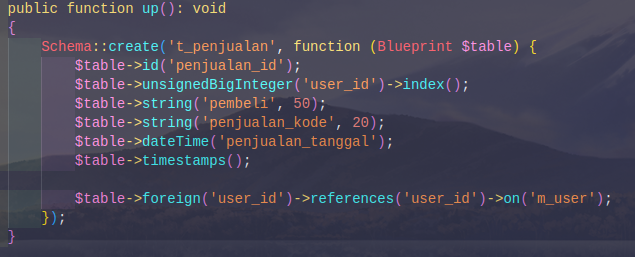
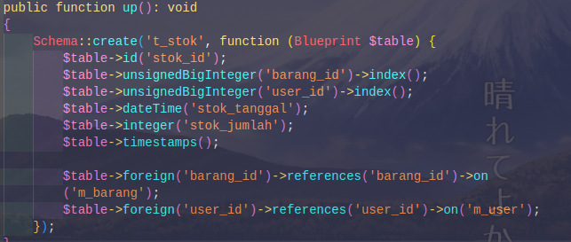
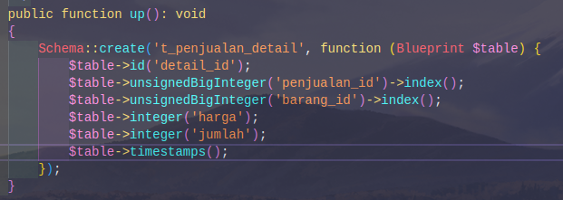
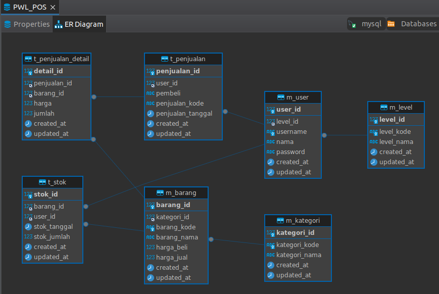

# JOBSHEET 03 MIGRATION, SEEDER, DB FAÇADE, QUERY BUILDER, dan ELOQUENT ORM
> Nama : Syahrul Bhudi Ferdiansyah <br>
> NIM  : 2241720167 <br>
> Kelas : TI-2F

## Pengaturan Database
-Praktikum 1
- Buka aplikasi phpMyAdmin, dan buat database baru dengan nama PWL_POS<br>
<br>
- Buka file .env, dan pastikan konfigurasi APP_KEY bernilai. Jika belum bernilai silahkan kalian generate menggunakan php artisan.
    ```shell
    APP_KEY=base64:pf+9aFnSDEboKCBeqGLwrtquEsEky8sZEMMbe2xU8Js=
    ```
- Edit file .env dan sesuaikan dengan database yang telah dibuat
    ```shell
    DB_CONNECTION=mysql
    DB_HOST=172.17.0.1
    DB_PORT=3306
    DB_DATABASE=PWL_POS
    DB_USERNAME=root
    DB_PASSWORD=
    ```
## Migration
-Praktikum 2.1
- buat file migrasi untuk table m_level dengan perintah<br>
<br>
<br>
- modifikasi sesuai desain database yang sudah ada
    ```php
    public function up(): void
        {
            Schema::create('m_level', function (Blueprint $table) {
                $table->id("level_id");
                $table->string("level_kode", 10)->unique();
                $table->string("level_nama", 100);
                $table->timestamps();
            });
        }
    ```
- Simpan kode pada tahapan 4 tersebut, kemudian jalankan perintah ini pada terminal VSCode untuk melakukan migrasi<br>
<br>
- Kemudian kita cek di phpMyAdmin apakah table sudah ter-generate atau belum

- Buat table database dengan migration untuk table m_kategori yang sama-sama tidak memiliki foreign key
    ```php
        public function up(): void
    {
        Schema::create('m_kategori', function (Blueprint $table) {
            $table->id("kategori_id");
            $table->string("kategori_kode", 10)->unique();
            $table->string("kategori_nama", 100);
            $table->timestamps();
        });
    }
    ```
    <br>
-Praktikum 2.2
- Buat file migrasi untuk table m_user<br>

- Buka file migrasi untuk table m_user, dan modifikasi seperti berikut<br>
<br>
- alankan perintah php artisan migrate. Amati apa yang terjadi pada database.<br>

>Hal yang terjadi adalah pada database terbentuk tabel baru yang bernama m_user yang sudah menjalin hubungan dengan m_level

- Buat table database dengan migration untuk table-tabel yang memiliki foreign key <br>
  - m_barang<br>
  <br>
  - t_penjualan<br>
    <br>
  - t_stok<br>
  <br>
  - t_penjualan_detail<b>
    <br>
- Bentuk Hubungan<br>
<br>

