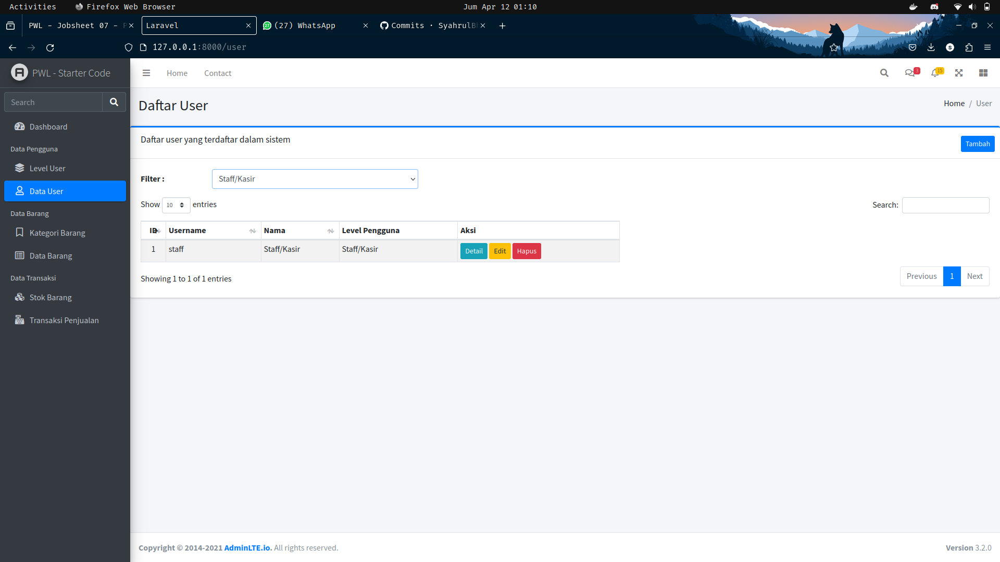

# JOBSHEET 07 - LARAVEL STARTER CODE

> Nama : Syahrul Bhudi Ferdiansyah <br>
> NIM : 2241720167 <br>
> Kelas : TI-2F

## A. Layouting AdminLTE

- Hasil akhir template.blade.php<br>
  .png)<br>

## B. Penerapan Layouting

- Welcome Controller

```php
<?php

namespace App\Http\Controllers;

use Illuminate\Http\Request;

class WelcomeController extends Controller
{
    function index()
    {
        $breadcrumb = (object) [
            'title' => 'Selamat Datang',
            'list' => ['Home', 'Welcome']
        ];

        $activeMenu = 'dashboard';

        return view('welcome', ['breadcrumb' => $breadcrumb, 'activeMenu' => $activeMenu]);
	}
}
```

- Welcome.blade

```php
@extends('layouts.template')

@section('content')
    <div class="card">
        <div class="card-header">
            <h3 class="card-title">Halo, apakabar!!!</h3>
            <div class="card-tools"></div>
        </div>
        <div class="card-body">
            Selamat datang semua, ini adalah halaman utama dari aplikasi ini
        </div>
    </div>
@endsection
```

- Modifikasi breadcrumb blade

```php
<section class="content-header">
    <div class="container-fluid">
        <div class="row mb-2">
            <div class="col-sm-6">
                <h1>{{$breadcrumb->title}}</h1>
            </div>
            <div class="col-sm-6">
                <ol class="breadcrumb float-sm-right">
                    @foreach($breadcrumb->list as $key => $value)
                        @if($key == count($breadcrumb->list - 1))
                            <li class="breadcrumb-item active">{{$value}}</li>
                        @else
                            <li class="breadcrumb-item">{{$value}}</li>
                        @endif
                    @endforeach
                </ol>
            </div>
        </div>
    </div><!-- /.container-fluid -->
</section>
```

- Hasil <br>
  .png)<br>

## C. Implementasi jQuery Datatable

- Modifikasi Route

```php
Route::prefix('/user')->group(function () {
    Route::get('/', [UserController::class, 'index']);
    Route::get('/list', [UserController::class, 'list']);
    Route::get('/create', [UserController::class, 'create']);
    Route::post('/', [UserController::class, 'store']);
    Route::get('/{id}', [UserController::class, 'show']);
    Route::put('/{id}', [UserController::class, 'update']);
    Route::delete('/{id}', [UserController::class, 'destroy']);
});
```

- Modifikasi UserController

```php
function index()
    {
        $breadcrumb = (object)[
            'title' => 'Daftar User',
            'list' => ['Home', 'User']
        ];

        $page = (object)[
            'title' => 'Daftar user yang terdaftar dalam sistem'
        ];

        $activeMenu = 'user';

        return view('user.index', ['breadcrumb' => $breadcrumb, 'page' => $page, 'activeMenu' => $activeMenu]);
    }
```

- Hasil<br>
  .3.1.png)
- Create <br>
  
- Hasil create<br>
  

> Disini saya menambahkan pelanggan12 dengan nama Ahmad Soerjo dan hasilnya sukses tersimpan di database

- Hasil show<br>
  

> Hasilnya sesuai, data user ditampilkan dengan benar

- Hasil edit<br>
  <br>
  <br>

> Disini saya mengganti nama dari pelanggan12 menjadi Ahmad Soerjo Raharjo dan berhasil

- Hasil delete<br>
  <br>

> Disini saya mencoba menghapus manager 56<br>

<br><br>
> Hasilnya user manager 56 berhasil di hapus

## D. Data Searching and Filtering

- Hasil filtering <br>
  

## E. Pertanyaan

1. Apa perbedaan frontend template dengan backend template?

> Frontend template biasanya digunakan untuk mengatur tampilan dan interaksi pengguna di sisi klien (di browser),
> seperti HTML, CSS, dan JavaScript yang bertanggung jawab untuk membangun tampilan yang dapat dilihat dan diinteraksi
> oleh pengguna. Sementara itu, backend template digunakan untuk mengatur logika dan fungsi yang terjadi di sisi server,
> seperti mengelola database, otentikasi pengguna, dan routing.

2. Apakah layouting itu penting dalam membangun sebuah website?

> Layouting sangat penting dalam membangun sebuah website karena layout adalah kerangka dasar dari tampilan halaman web.
> Layout yang baik memastikan bahwa konten disusun secara terstruktur, mudah dinavigasi, dan estetik.

3. Jelaskan fungsi dari komponen laravel blade berikut : @include(), @extend(), @section(), @push(), @yield(), dan
   @stack()

> @include('view'): Digunakan untuk menyisipkan konten dari file view lain ke dalam view saat ini.<br>
> @extend('layout'): Digunakan untuk mengambil layout utama yang akan digunakan oleh view saat ini.<br>
> @section('content'): Digunakan untuk menentukan bagian konten dari sebuah layout.<br>
> @push('scripts'): Digunakan untuk menambahkan script baru ke dalam sebuah stack, biasanya digunakan untuk menambahkan script pada bagian bawah halaman. <br>
> @yield('section'): Digunakan untuk menampilkan konten dari sebuah section yang telah didefinisikan di layout.<br>
> @stack('scripts'): Digunakan untuk menampilkan stack tertentu yang telah didefinisikan di layout.<br>

4. Apa fungsi dan tujuan dari variable $activeMenu ?

> variabel tersebut digunakan untuk menentukan style yang akan digunakan di bagian sidebar atau dalam kata lain
> digunakan untuk menampilkan menu yang sedang di pilih saat ini 
