# JOBSHEET 6 - Template Form (AdminLTE), Server Validation, Client Validation, CRUD

> Nama : Syahrul Bhudi Ferdiansyah <br>
> NIM : 2241720167 <br>
> Kelas : TI-2F

## A. Template Form (AdminLTE)

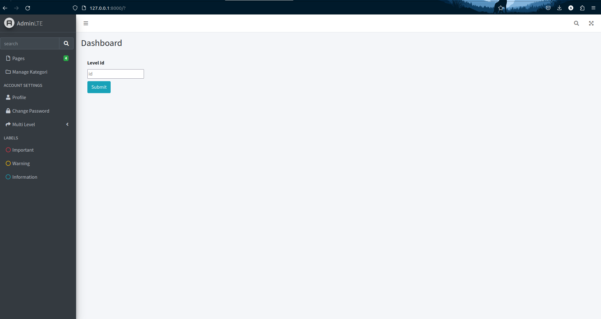<br>
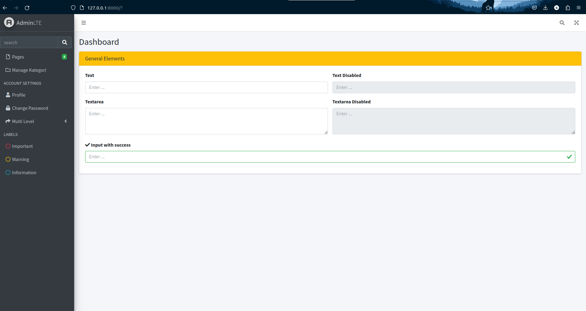<br>

## B. VALIDASI PADA SERVER

-   Validasi <br>

```php
    function store(Request $request) {
        $validator = Validator::make($request->all(), [
            'kodeKategori' => 'required',
            'namaKategori' => 'required',
        ]);

        if ($validator->fails()) {
            return redirect('/kategori/create')
                ->withErrors($validator)
                ->withInput();
        }

        Kategori::create([
            'kategori_kode' => $request->kodeKategori,
            'kategori_nama' => $request->namaKategori,
        ]);
        return redirect('/kategori');
    }
```

-   Tulis perbedaan penggunaan validate dengan validateWithBag!

    > Metode validate() langsung menangani validasi data dari permintaan dan mengembalikan respons kesalahan yang telah ditetapkan jika validasi gagal, sedangkan metode validateWithBag() memungkinkan untuk menetapkan pesan kesalahan ke "tas" yang dapat diatur sendiri, memberikan lebih banyak kendali atas bagaimana pesan kesalahan tersebut ditampilkan atau diproses.

-   tetapkan bail aturan ke atribut: coba sesuaikan dengan field pada m_kategori, apa yang terjadi?

```php
 $validator = Validator::make($request->all(), [
            'kodeKategori' => 'bail|required|unique:posts|max:255',
            'namaKategori' => 'required',
        ]);
```

> Dengan menetapkan aturan bail pada atribut, jika validasi pada atribut tersebut gagal, Laravel akan menghentikan proses validasi lebih lanjut untuk atribut lainnya dan langsung mengembalikan pesan kesalahan untuk atribut yang gagal tersebut.

-   Pada view/create.blade.php tambahkan code berikut agar ketika validasi gagal, kita
    dapat menampilkan pesan kesalahan dalam tampilan: <br>

```php
    @if ($errors->any())
        <div class="alert alert-danger">
            <ul>
                @foreach ($errors->all() as $error)
                    <li>{{ $error }}</li>
                @endforeach
            </ul>
        </div>
    @endif
```

Hasil <br>
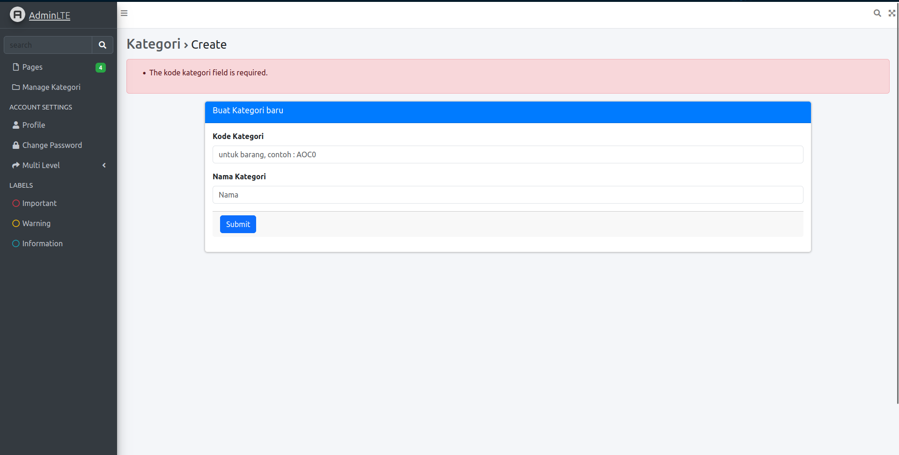 <br>

-   Pada view/create.blade.php tambahkan dan coba running code berikut :<br>

```php
<input type="text" class="@error('kodeKategori') is-invalid @enderror form-control"
id="kodeKategori" name="kodeKategori" placeholder="untuk barang, contoh : AOC0">

@error('kodeKategori')
    <div class="alert alert-danger">{{ $message }}</div>
@enderror
```

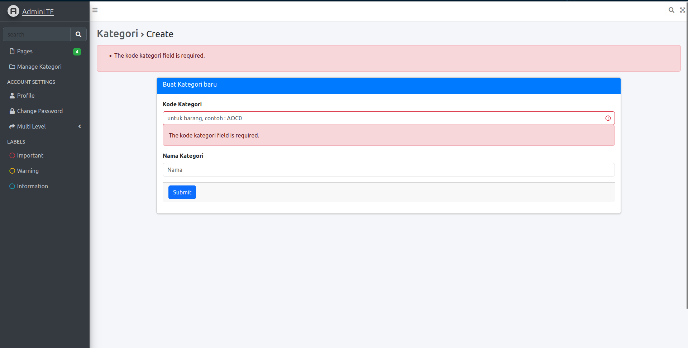<br>

## C. FORM REQUEST VALIDATION

-   StorePostRequest

```php
<?php

namespace App\Http\Requests;

use Illuminate\Foundation\Http\FormRequest;

class StorePostRequest extends FormRequest
{
    /**
     * Determine if the user is authorized to make this request.
     */
    public function authorize(): bool
    {
        return true;
    }

    /**
     * Get the validation rules that apply to the request.
     *
     * @return array<string, \Illuminate\Contracts\Validation\ValidationRule|array<mixed>|string>
     */
    public function rules(): array
    {
        return [
            'kodeKategori' => 'required',
            'namaKategori' => 'required',
        ];
    }
}
```

-   Hasil
    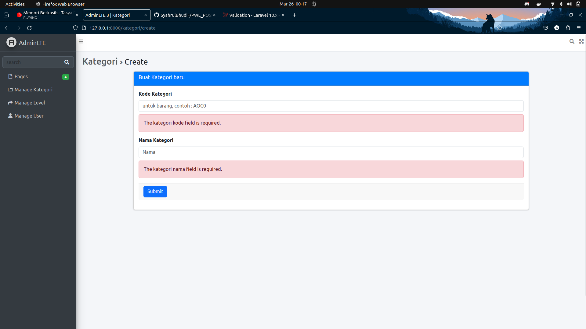<br>

## D. CRUD(create, read, update, delete

-   Halaman awal m_user<br>
    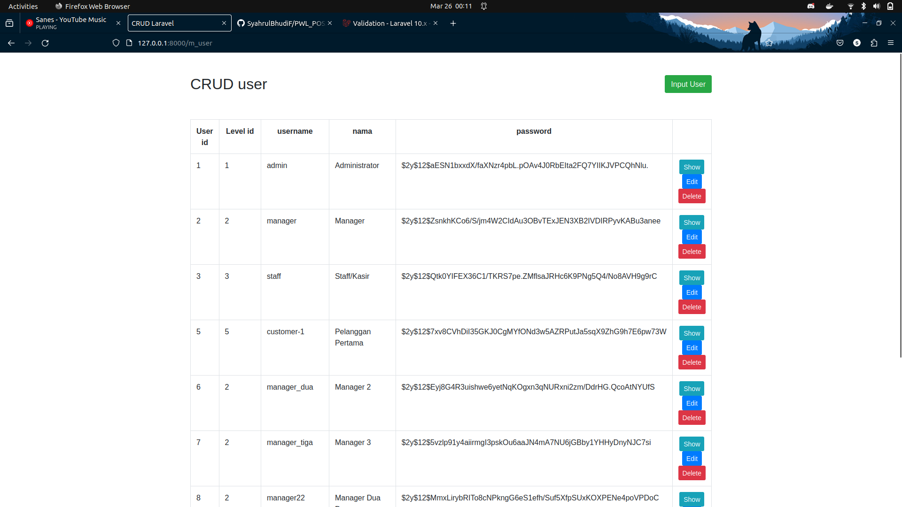
-   Halaman input user<br>
    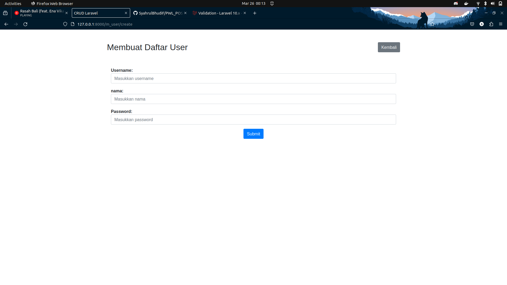
-   Halaman show user<br>
    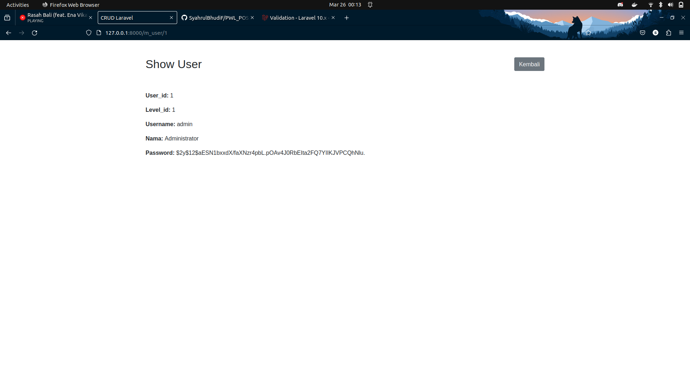
-   Halaman edit user<br>
    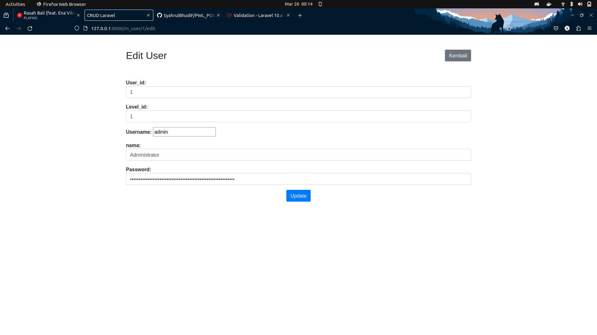
-   Notif delete user<br>
    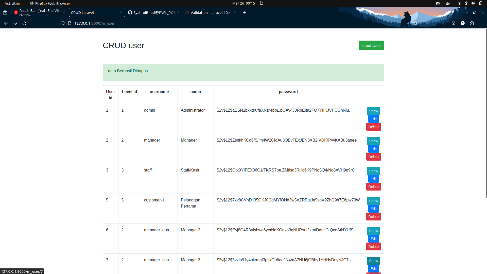

## Tugas

1. Coba tampilkan level_id pada halaman web tersebut dimana field ini merupakan foreign key
   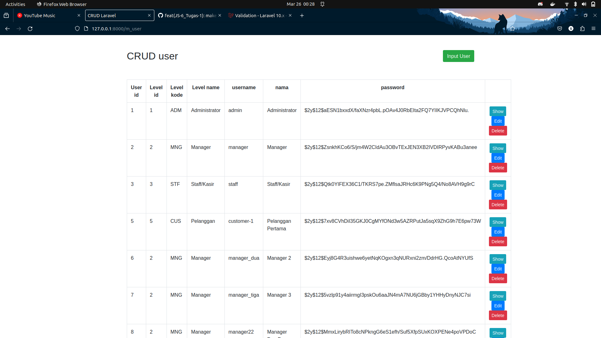<br>
   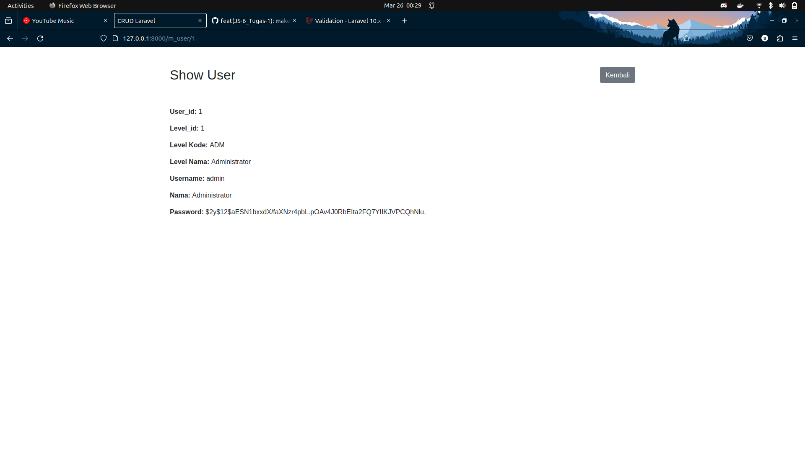<br>
   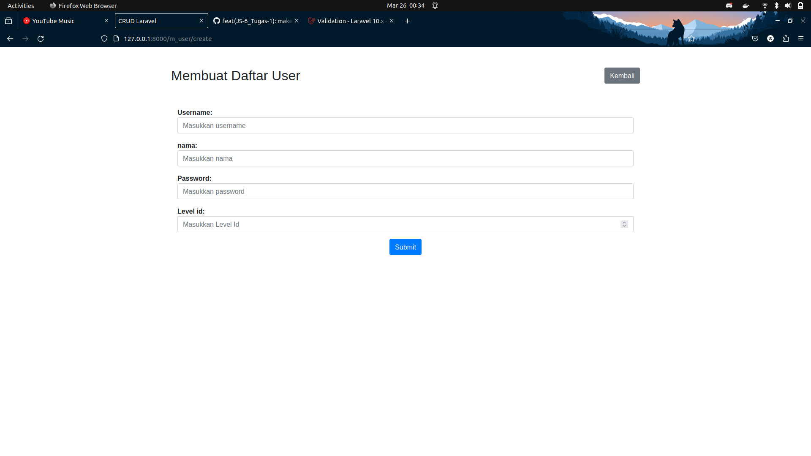<br>
2. Modifikasi dengan tema/ template kesukaan Anda

   > Saya menyesuaikan dengan tema awal dari AdminLTE

    - Home
      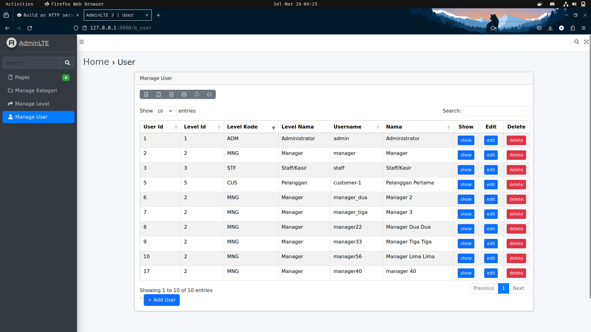
    - Add
      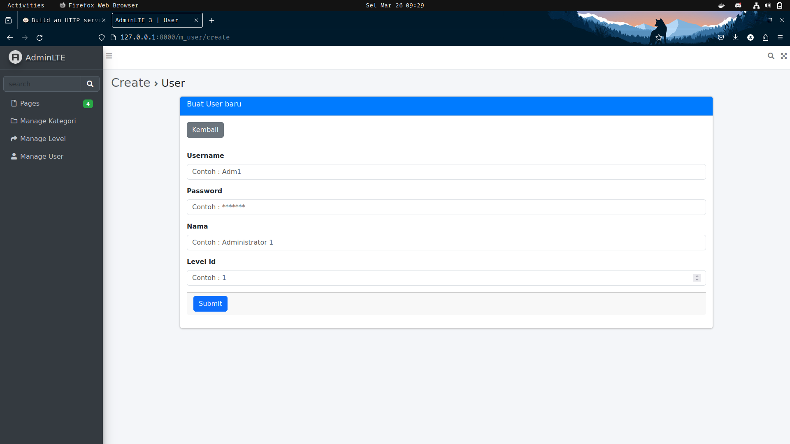
    - Show
      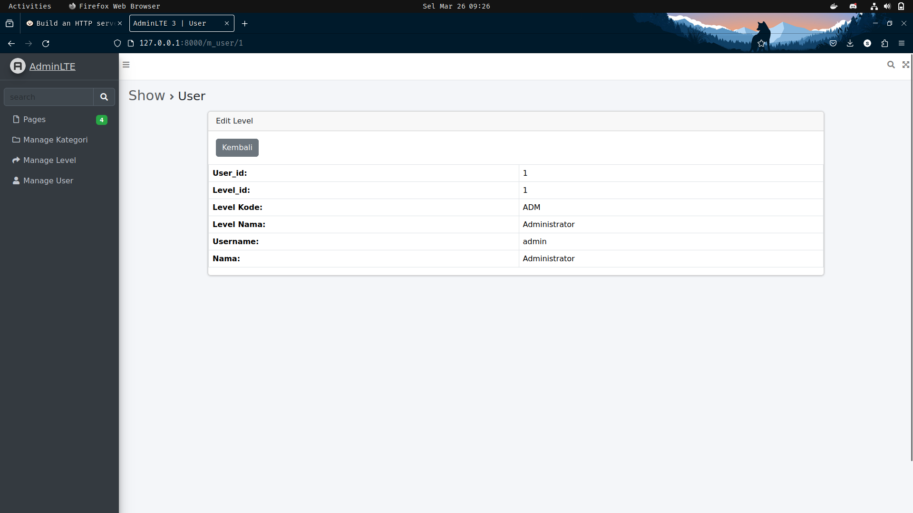
    - Edit
      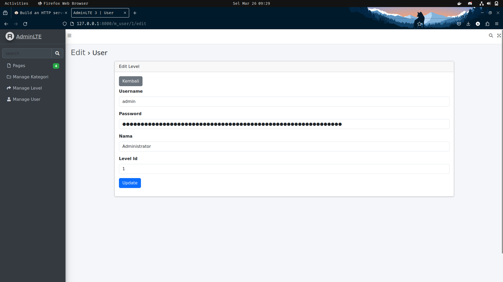

3. Apa fungsi $request->validate, $error dan alert yang ada pada halaman CRUD tersebut

    - $request->validate:
      Fungsi ini digunakan untuk memvalidasi input data yang dikirimkan melalui formulir. Fungsi ini menerima beberapa parameter dalam bentuk array assoc, yaitu:

        - Nama field: Nama field yang ingin divalidasi.
        - Rules: Aturan validasi yang ingin diterapkan. Aturan validasi dapat berupa:
            - required: Memastikan field tidak kosong.
            - tipe data: String|Number|Bool.
            - numeric: Memastikan field berisi angka.
            - min: Memastikan nilai field minimal sama dengan nilai yang ditentukan.
            - max: Memastikan nilai field maksimal sama dengan nilai yang ditentukan.

    - $error:
      Variabel $error merupakan return dari validate ketika nilai yang di validate salah atau tidak sesuai dengan rules yang diberikan
    - alert:
      Fungsi ini digunakan untuk menampilkan pesan kepada pengguna. Fungsi ini menerima dua parameter, yaitu:
        - Tipe pesan: Tipe pesan dapat berupa success, error, warning, atau info.
        - Message (Pesan): Pesan yang ingin ditampilkan kepada pengguna.
